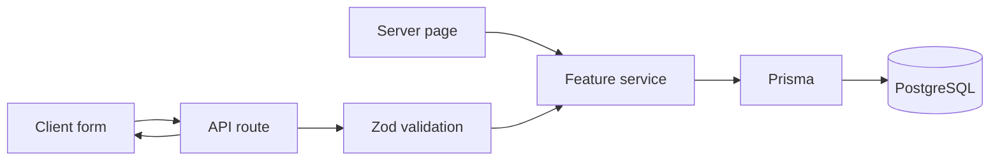

# Novellia Pets software design

Status: implemented baseline for iteration.

## Product

Help pet owners preserve their pets' medical history and see what needs attention next. The audience is an owner managing a small number of pets, rather than a veterinary clinic processing appointments.

Success means complete pet/record CRUD, useful search, an overview, follow-up tracking, durable PostgreSQL storage, and an understandable path for adding a record type.

## Decisions

| Area             | Implementation                                                                    |
| ---------------- | --------------------------------------------------------------------------------- |
| Application      | Next.js 16 App Router, React 19, TypeScript                                       |
| UI               | Astryx 0.6.2, a custom Novellia theme, Tailwind CSS v4 with Astryx's token bridge |
| Server           | Route Handlers plus ordinary feature-service functions                            |
| Database         | Prisma ORM 7 and PostgreSQL                                                       |
| Environments     | Local Docker; target: Prisma Postgres on Vercel (remote verification pending)     |
| Identity         | One shared fictional workspace, no authentication                                 |
| Reads            | Dynamic Server Components call services directly                                  |
| Writes           | Client fetch, Zod validation, service, Prisma, refreshed page                     |
| Record extension | Validated type-specific JSON with explicit React components                       |
| State            | Form state in React; search state in URL; source of truth in PostgreSQL           |

The lockfile pins actual package versions. Styling uses bundled CSS rather than a StyleX build plugin. Components are imported through explicit package entrypoints.

## Feature RFCs

1. [Architecture and data model](rfcs/001-architecture.md)
2. [Visual system and navigation](rfcs/002-visual-system.md)
3. [Pet management](rfcs/003-pets.md)
4. [Medical records and extension](rfcs/004-medical-records.md)
5. [Search and filtering](rfcs/005-search.md)
6. [Overview dashboard](rfcs/006-dashboard.md)
7. [Follow-ups](rfcs/007-follow-ups.md)
8. [Delivery and verification](rfcs/008-delivery.md)
9. [Reusable care providers](rfcs/009-care-providers.md)
10. [Clinic scheduling and timezones](rfcs/010-clinic-scheduling.md)

Each RFC records screen structure, behavior, data dependencies, interfaces, tradeoffs, and acceptance checks.

## Runtime

Application services import `server-only`. Database configuration is separately importable by seed and test scripts. Shared domain code never imports React, Prisma, or environment secrets.

## Boundaries

Calendar dates represent a day, not an instant. They are stored as PostgreSQL DATE, serialized as YYYY-MM-DD, and formatted in UTC to avoid display shifts. The server passes the configured current day to historical-date forms. Calendar display includes the year even with an abbreviated month. Follow-up status is computed from the saved clinic timezone and optional appointment instant; unresolved zones fall back to APP_TIME_ZONE.

Historical medical records are editable and deletable. This app does not claim clinical immutability, HIPAA compliance, prescription guidance, or real-time collaboration.

## Future changes

Authentication would add an owner/workspace relation and require ownership filters in every read and mutation. Multiple tasks per record would introduce a FollowUp table. Cross-record reporting could promote frequently queried JSON properties into columns or related tables.

These are future changes, not partially implemented abstractions.

## Timestamp display

Completed, added, and updated timestamps are stored as PostgreSQL timestamptz and serialized as full UTC ISO instants. The shared LocalTimestamp component displays their dates in each visitor's browser timezone; its tooltip includes the local time and timezone. The initial server render uses a brief placeholder until the browser timezone is available, preventing a hydration mismatch or a misleading UTC date.

Calendar-only fields (birth date, medical event date, medication end date, and follow-up due date) remain YYYY-MM-DD and do not shift across timezones. APP_TIME_ZONE defines today for historical-date validation and is the fallback for legacy reminders whose provider location is unresolved. Follow-ups use their clinic timezone when resolved; scheduled appointments become overdue at their exact instant. Browser-local timestamp display does not change stored calendar dates. See RFC 010 for clinic scheduling.

## Clinic scheduling

[RFC 010](rfcs/010-clinic-scheduling.md) extends follow-ups with a distinct clinic selection, an optional appointment time, address-derived timezones, and browser-local versus clinic-time displays. Existing appointments retain their original timezone snapshot when a provider moves.
